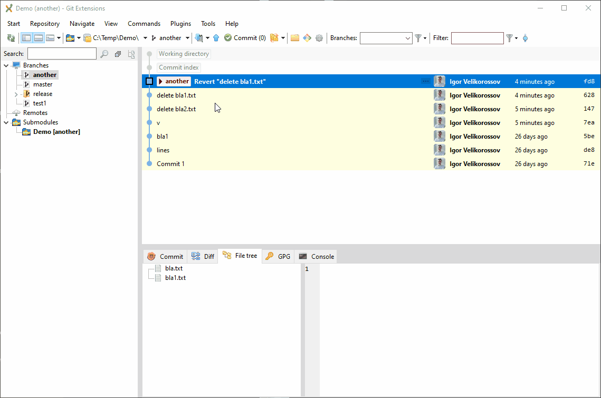

# Git

## squash коммитов (GitExtensions)

1. выбрать коммит до которого squash
2. в контекстном меню выбрать "rebase current brunch on/Selected commit interactively..."
3. в диалоге "rebase current brunch interactively" подтвердить
4. для всех коммитов кроме верхнего поставить вместо "pick" "s"
5. нажать "сохранить" (на панели) и "закрыть" (window)
6. в открывшемся диалоге удалить или закоменировать через "#" коментарии
  и написать новый
7. нажать "сохранить" (на панели) и "закрыть" (window)
8. нажать push
9. в диалоге открывшемся диалоге - "Force push with lease"

